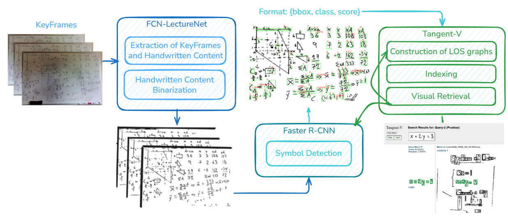
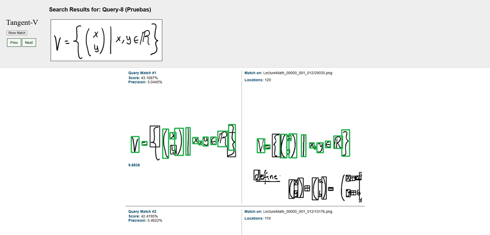
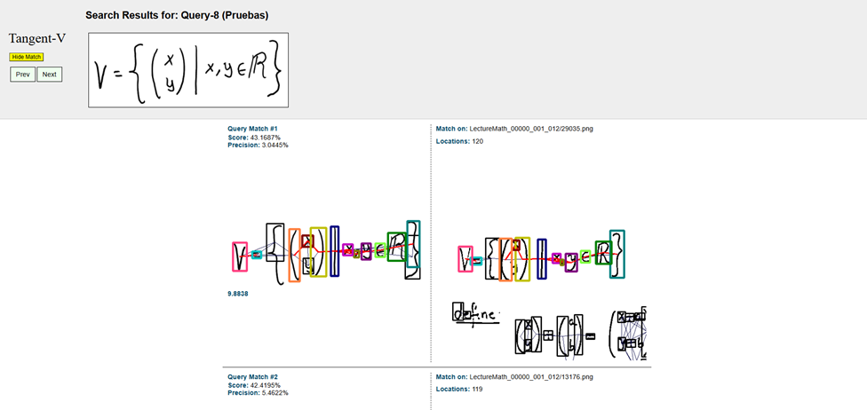

# Math Symbol Recognizer Using Faster R-CNN

This project implements a **Faster R-CNN** object detection model (using a **ResNet50-FPN** backbone) to recognize handwritten mathematical symbols. It is specifically engineered to handle the significant domain gap between **digital ink datasets** (CROHME) and **real-world whiteboard images**.

While this repository contains the symbol recognition model, it was developed as the core component of a larger graduation project aimed at the end-to-end visual retrieval of mathematical expressions from lecture whiteboards.

## 🧩 Context: Complete Project Pipeline

This Faster R-CNN model serves as the critical symbol-detection bridge in a complete visual retrieval pipeline. The full project integrates existing tools, adapting them to work together seamlessly for whiteboard math retrieval. 

<p align="center">
    
</p>

*(Above: Architecture of the complete project pipeline)*

#### The full pipeline consists of three main steps:

1. **Content Extraction & Binarization**: 
   Handwritten content is extracted and binarized from raw whiteboard images using a retrained **FCN-LectureNet** model. 
   > *Reference: Davila, K., Xu, F., Setlur, S., & Govindaraju, V. (2021). Fcn-lecturenet: extractive summarization of whiteboard and chalkboard lecture videos. IEEE Access, 9, 104469-104484.(https://ieeexplore.ieee.org/document/9496159)*

2. **Symbol Detection (This Repository)**: 
   The extracted math regions are passed through this custom **Faster R-CNN model** to detect and classify individual mathematical symbols, replacing traditional Connected Components + OCR pipelines.
   
    <p align="center">
        
    </p>

   *(Above: Example of the Faster R-CNN detecting symbols on a whiteboard image)*

3. **Graph Indexing & Visual Retrieval**: 
   The bounding boxes and class predictions from the Faster R-CNN are fed into an adapted version of **Tangent-V**, which creates Line-Of-Sight (LOS) graphs to represent the spatial relationships between symbols, allowing the system to perform visual structural retrieval of the mathematical expressions.
   > *Reference: Davila, K., Joshi, R., Setlur, S., Govindaraju, V., & Zanibbi, R. (2019). Tangent-V: Math formula image search using line-of-sight graphs. In European conference on information retrieval (pp. 681-695). Springer, Cham.(https://link.springer.com/chapter/10.1007/978-3-030-15712-8_44)*

   <p align="center">
     
     
   </p>

   *(Above Left: Retrieval showing Bounding boxes. Above Right: Retrieval showing the matching LOS graphs)*

---

## 📊 Results & Metrics

The system was evaluated both on isolated symbol detection (the model in this repo) and on the end-to-end retrieval task (the full pipeline).

**Faster R-CNN Detection Performance:**

| Metric | Score | Notes |
| :--- | :--- | :--- |
| **mAP (IoU 0.5:0.95)** | **66.00%** | Achieved after 52 epochs of training. |

**End-to-End Pipeline Retrieval Performance:**
Using the detections from this model, the full visual retrieval pipeline achieved the following metrics:

| Retrieval Metric | Score |
| :--- | :--- |
| **Precision@1** | 80.00% |
| **Precision@3** | 63.33% |
| **Precision@5** | 57.00% |
| **Mean Reciprocal Rank (MRR)** | 55.42% |

---

## ✨ Key Features & Methodology


### Key Features & Methodology

*   **Model Architecture**: The project utilizes a Faster R-CNN model pretrained on ImageNet. During training, the **entire backbone** (all 5 layers of ResNet50) is fine-tuned to adapt to the specific features of handwritten strokes, while the region proposal and classification heads are trained from scratch.
*   **Domain Adaptation via Augmentation**: To bridge the gap between the clean, thin strokes of digital ink and the noisy, thick strokes of whiteboard markers, a heavy augmentation pipeline with thresholding is employed. This includes:
    *   **Morphological Dilation**: To simulate the thickness of whiteboard markers.
    *   **Noise Injection**: To mimic sensor noise and whiteboard imperfections.
    *   **Geometric Transformations**: Random shearing, rotation, and scaling to account for handwriting variability.
*   **Statistical Anchor Calibration**: The system features a custom strategy that calibrates the model's **anchor sizes and aspect ratios** based on the statistical distribution of the target domain (whiteboard), ensuring the Region Proposal Network (RPN) is optimized for the actual scale of the symbols it will encounter.

## 📂 Project Structure

```text
Math-Symbol-Recognizer-Using-FasterRCNN/
├── configs/                    # Configuration files for CPU and CUDA training
│   ├── config_cpu.json
│   └── config_cuda.json
├── data/                       # Generated annotations and class mappings
│   ├── calibrated_whiteboard_bboxes.json  # Pre-calculated whiteboard stats
│   ├── class_mapping.json      # Map between symbol names and IDs
│   └── train_annotations.json  # Parsed training data
├── img_readme/                 # Visualizations for pipeline and results in ReadMe
├── output/                     # Training outputs
│   ├── logs/                   # TensorBoard logs and JSON reports
│   └── models/                 # Saved model checkpoints (.pth)
├── TC11_CROHME23/              # Dataset folder (CROHME)
├── check_bboxes.py             # Utility to visualize ground truth bounding boxes
├── eda_calibration.py          # Calculates scaling factors between domains
├── eda_crohme_whiteboard.py    # Helper logic for EDA and calibration
├── inference.py                # Run inference on new images
├── inference_dataset.py        # Dataset class for inference
├── inference_utils.py          # Utilities for batch grouping and visualization
├── math_symbols_dataset.py     # PyTorch Dataset implementation
├── model.py                    # Faster R-CNN model definition
├── parser.py                   # Parses raw CROHME .lg files into JSON
├── train.py                    # Main training loop
├── train_utils.py              # Training helpers (saving, logging)
├── utils.py                    # General utilities
├── requirements.txt            # CPU dependencies
└── requirements_cuda.txt       # GPU/CUDA dependencies
```

## 🚀 Installation

1.  **Clone the repository** and navigate to the project folder.

2.  **Create a Virtual Environment**:
    ```bash
    python -m venv .venv
    ```

3.  **Activate the Environment**:
    *   **Windows**:
        ```bash
        .venv\Scripts\activate
        ```
    *   **Linux/Mac**:
        ```bash
        source .venv/bin/activate
        ```

4.  **Install Dependencies**:
    *   For **GPU/CUDA** (Recommended):
        ```bash
        pip install -r requirements_cuda.txt
        ```
    *   For **CPU** only:
        ```bash
        pip install -r requirements.txt
        ```

---

## 🛠️ Usage Guide

Follow these steps to prepare data, train the model, and run inference.

### 1. Data Preparation
First, parse the raw CROHME dataset (located in `TC11_CROHME23`) into a format the model can understand. This script generates `data/train_annotations.json` and `data/class_mapping.json`.

```bash
python parser.py configs/config_cuda.json
```

### 2. Domain Calibration
This step calculates the optimal anchor sizes and scaling factors to adapt the model from digital ink to whiteboard images.

*   **Note:** The project comes with a pre-calculated `data/calibrated_whiteboard_bboxes.json`. This allows you to skip the manual bounding box selection process.

Run the calibration script to generate the final model configuration:

```bash
python eda_calibration.py configs/config_cuda.json
```

### 3. Training
Start the training process. The script will use the configuration file to set hyperparameters, paths, and model settings.

```bash
python train.py configs/config_cuda.json
```
*   Checkpoints are saved to `output/models/`.
*   Logs are saved to `output/logs/`.

### 4. Inference
To test the model on a new image (e.g., a photo of a whiteboard):

```bash
python inference.py configs/config_cuda.json <inference_folder_path> <checkpoint_path>
```
1.  The script will run the model and save the results.
2.  Results are saved in the `results/<inference_folder_path>` folder.

## ⚙️ Configuration
The `configs/` folder contains JSON files to control the pipeline.
*   **`paths`**: Directories for data, logs, and models.
*   **`model_params`**: Anchor sizes, aspect ratios, and model architecture settings.
*   **`training_params`**: Learning rate, batch size, epochs, and scheduler settings.
*   **`inference_params`**: Batch size and other inference-specific settings.
*   **`transform_params`**: Image resizing and augmentation settings.
